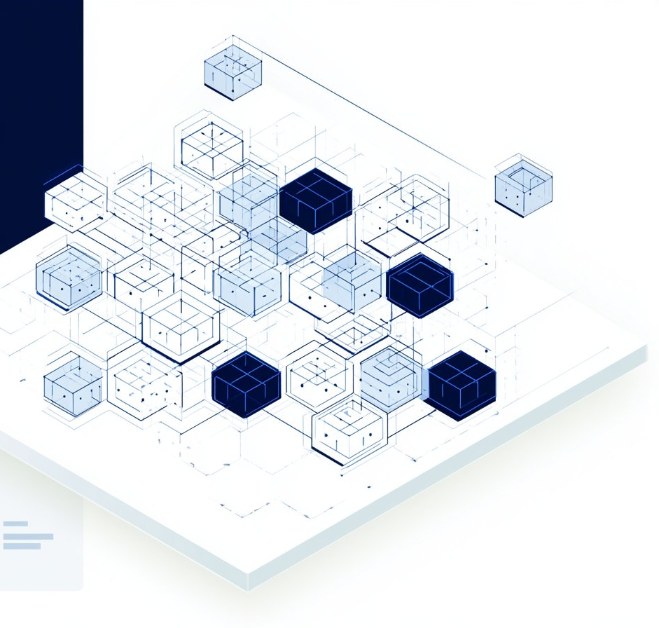

#

  <header class="cilm-topbar" aria-label="CILM site header">
    <a class="cilm-brand" href="/" aria-label="CILM home">
      
      
        CILM
        Component Integrity &amp; Lifecycle Management
      
    </a>
    <nav class="cilm-nav" aria-label="Primary navigation">
      <a href="/framework/">Framework</a>
      <a href="/risk-intelligence/">Risk Intelligence</a>
      <a href="/us-application/">U.S. Application</a>
      <a href="/data-and-publications/">Data &amp; Publications</a>
      <a href="/about/">About</a>
    </nav>
  </header>

  <section class="cilm-hero" aria-labelledby="cilm-home-title">
    

      
      
Electronic Component Supply Chain

      <h1 id="cilm-home-title" class="cilm-hero-title">Risk-scoring methodology for <em>counterfeit-resilient</em> component procurement</h1>
      
CILM provides a structured, auditable methodology for component verification, documentation integrity, and supply-chain risk intelligence — informed by OECD counterfeit-trade context and aligned with SAE AS6171 verification logic.

      

        <a class="cilm-button cilm-button-primary" href="/framework/">Explore the framework →</a>
        <a class="cilm-button cilm-button-secondary" href="/risk-intelligence/">View dataset — IEEE DataPort →</a>
      

    

    

      
    

  </section>

  <section class="cilm-evidence-strip" aria-label="Public research evidence strip">
    <a class="cilm-evidence-item" href="/risk-intelligence/">
      <svg viewBox="0 0 24 24" fill="none" stroke="currentColor"><ellipse cx="12" cy="5" rx="8" ry="3"/><path d="M4 5v6c0 1.7 3.6 3 8 3s8-1.3 8-3V5"/><path d="M4 11v6c0 1.7 3.6 3 8 3s8-1.3 8-3v-6"/></svg>
      DatasetIEEE DataPort · N=67
    </a>
    <a class="cilm-evidence-item" href="/data-and-publications/">
      <svg viewBox="0 0 24 24" fill="none" stroke="currentColor"><path d="M14 2H6a2 2 0 0 0-2 2v16a2 2 0 0 0 2 2h12a2 2 0 0 0 2-2V8z"/><path d="M14 2v6h6"/><path d="M8 13h8M8 17h6"/></svg>
      White PaperZenodo · DOI
    </a>
    <a class="cilm-evidence-item" href="/risk-intelligence/">
      <svg viewBox="0 0 24 24" fill="none" stroke="currentColor"><path d="M4 14a8 8 0 1 1 16 0"/><path d="M12 14l4-6"/><path d="M6.3 12h1.4M16.3 12h1.4M12 6v1.4"/></svg>
      Scoring modelCIRS · [0, 1]
    </a>
    <a class="cilm-evidence-item" href="/data-and-publications/">
      <svg viewBox="0 0 24 24" fill="none" stroke="currentColor"><path d="M14 2H7a2 2 0 0 0-2 2v16a2 2 0 0 0 2 2h10a2 2 0 0 0 2-2V7z"/><path d="M14 2v5h5"/><path d="M8 12h8M8 16h8"/><path d="M8 20h5"/></svg>
      PreprintAuthor preprint · v1.9.2
    </a>
  </section>

  <section class="cilm-method-grid" aria-label="CILM method stack">
    <article class="cilm-method-card">
      

        <svg viewBox="0 0 24 24" fill="none" stroke="currentColor"><path d="M12 22s8-4 8-10V5l-8-3-8 3v7c0 6 8 10 8 10z"/><path d="m9 12 2 2 4-4"/></svg>
        01 — Scoring
      

      <h2 class="cilm-card-title">Risk Intelligence</h2>
      
CIRS converts observable supplier, channel, market, verification, and geographic indicators into a normalized risk score.

      
CIRS [0, 1] · 5-parameter weighted composite

      <a class="cilm-card-link" href="/risk-intelligence/">Risk Intelligence →</a>
    </article>
    <article class="cilm-method-card">
      

        <svg viewBox="0 0 24 24" fill="none" stroke="currentColor"><path d="M14 2H6a2 2 0 0 0-2 2v16a2 2 0 0 0 2 2h12a2 2 0 0 0 2-2V8z"/><path d="M14 2v6h6"/><path d="M9 15l2 2 4-4"/></svg>
        02 — Verification
      

      <h2 class="cilm-card-title">Documentation Integrity</h2>
      
CILM connects procurement documentation, verification evidence, and lifecycle records into an auditable integrity layer.

      
SAE AS6171-aligned · L1–L3 verification

      <a class="cilm-card-link" href="/standards-alignment/">Standards Alignment →</a>
    </article>
    <article class="cilm-method-card">
      

        <svg viewBox="0 0 24 24" fill="none" stroke="currentColor"><circle cx="12" cy="12" r="10"/><path d="M2 12h20"/><path d="M12 2a15.3 15.3 0 0 1 4 10 15.3 15.3 0 0 1-4 10 15.3 15.3 0 0 1-4-10A15.3 15.3 0 0 1 12 2z"/></svg>
        03 — Provenance
      

      <h2 class="cilm-card-title">Channel Provenance</h2>
      
Authorized-channel procurement establishes the risk floor; unknown-source procurement defines the structural risk ceiling.

      
S = 0.05 → 1.00 · channel-structure factor

      <a class="cilm-card-link" href="/framework/">Framework →</a>
    </article>
    <article class="cilm-method-card">
      

        <svg viewBox="0 0 24 24" fill="none" stroke="currentColor"><path d="M3 21h18"/><path d="M5 21V10h14v11"/><path d="M7 10V7l5-4 5 4v3"/><path d="M9 14h6M9 18h6"/></svg>
        04 — U.S. Market
      

      <h2 class="cilm-card-title">U.S. Application</h2>
      
Decision rules support risk-based procurement documentation in U.S. high-reliability supply-chain environments.

      
Decision rules · Auditable at procurement point

      <a class="cilm-card-link" href="/us-application/">U.S. Application →</a>
    </article>
  </section>

  <section class="cilm-section-cards" aria-label="CILM methodology sections">
    <article class="cilm-section-card">
      

        
        
      

      

        
Framework

        
A structured methodology for component verification, documentation integrity, and lifecycle risk management.

        <a class="cilm-section-card-link" href="/framework/">Learn more →</a>
      

    </article>
    <article class="cilm-section-card">
      

        
        
      

      

        
Risk Intelligence

        
CIRS scoring model — 5-parameter composite normalized [0, 1] across supplier, channel, and geographic indicators.

        <a class="cilm-section-card-link" href="/risk-intelligence/">Learn more →</a>
      

    </article>
    <article class="cilm-section-card">
      

        
        
      

      

        
White Papers

        
Methodological white paper published on Zenodo. DOI: 10.5281/zenodo.19657865

        <a class="cilm-section-card-link" href="/data-and-publications/">Read papers →</a>
      

    </article>
    <article class="cilm-section-card">
      

        
        
      

      

        
Datasets

        
CILM-IRI dataset (N=67) published on IEEE DataPort. DOI: 10.21227/34y3-zj88

        <a class="cilm-section-card-link" href="/risk-intelligence/">Explore datasets →</a>
      

    </article>
  </section>

  <section class="cilm-artifacts" aria-labelledby="cilm-artifacts-title">
    <h2 id="cilm-artifacts-title" class="cilm-artifacts-title">Public research artifacts</h2>
    <table class="cilm-artifact-table">
      <thead><tr><th>Artifact</th><th>Repository</th><th>DOI / Link</th></tr></thead>
      <tbody>
        <tr><td class="cilm-artifact-name"><svg viewBox="0 0 24 24" fill="none" stroke="currentColor"><path d="M14 2H7a2 2 0 0 0-2 2v16a2 2 0 0 0 2 2h10a2 2 0 0 0 2-2V7z"/><path d="M14 2v5h5"/><path d="M8 12h8M8 16h8"/></svg>CILM Methodological White Paper</td><td>Zenodo</td><td><a href="https://doi.org/10.5281/zenodo.19657865">10.5281/zenodo.19657865 ↗</a></td></tr>
        <tr><td class="cilm-artifact-name"><svg viewBox="0 0 24 24" fill="none" stroke="currentColor"><ellipse cx="12" cy="5" rx="8" ry="3"/><path d="M4 5v6c0 1.7 3.6 3 8 3s8-1.3 8-3V5"/><path d="M4 11v6c0 1.7 3.6 3 8 3s8-1.3 8-3v-6"/></svg>CILM-IRI Dataset (N=67)</td><td>IEEE DataPort</td><td><a href="https://doi.org/10.21227/34y3-zj88">10.21227/34y3-zj88 ↗</a></td></tr>
        <tr><td class="cilm-artifact-name"><svg viewBox="0 0 24 24" fill="none" stroke="currentColor"><path d="M4 4h16v16H4z"/><path d="M8 8h8M8 12h8M8 16h5"/></svg>Methodological Article / Preprint</td><td>This site</td><td><a href="/data-and-publications/">Data &amp; Publications ↗</a></td></tr>
      </tbody>
    </table>
  </section>

  <section class="cilm-disclaimer" aria-label="Independent methodology disclaimer">
    
    
CILM is an independent methodology — not affiliated with or endorsed by SAE, IEEE, NIST, or any U.S. government agency.

  </section>

  <footer class="cilm-footer">
    © 2024–2026 CILM
    <a href="/industry-context/">Transparency</a><a href="/about/">About</a><a href="/recognition/">Recognition</a><a href="/data-and-publications/">Publications</a>
  </footer>

